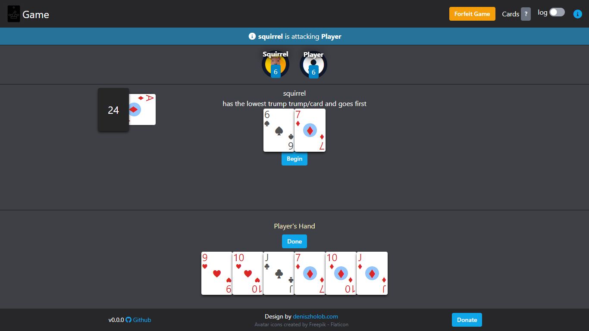
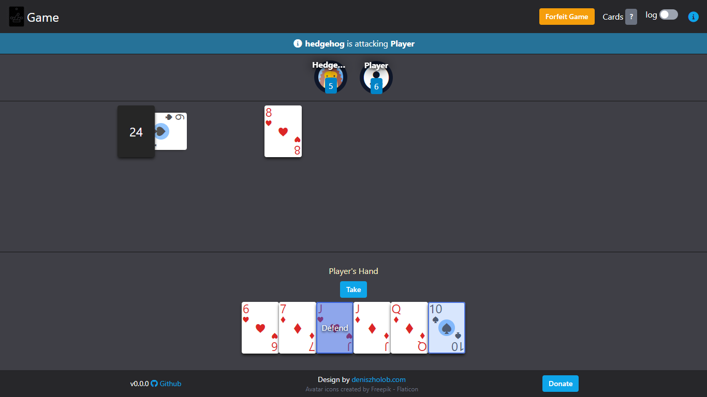
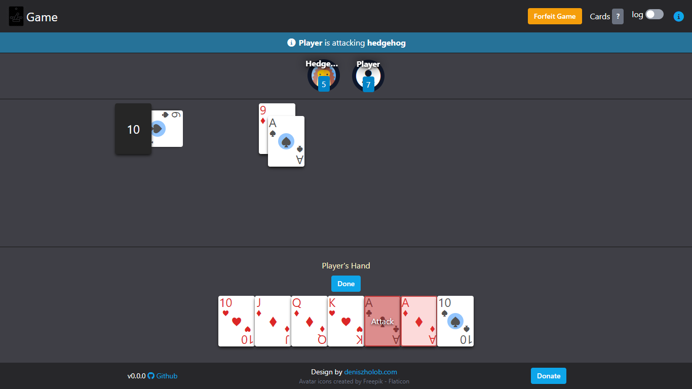
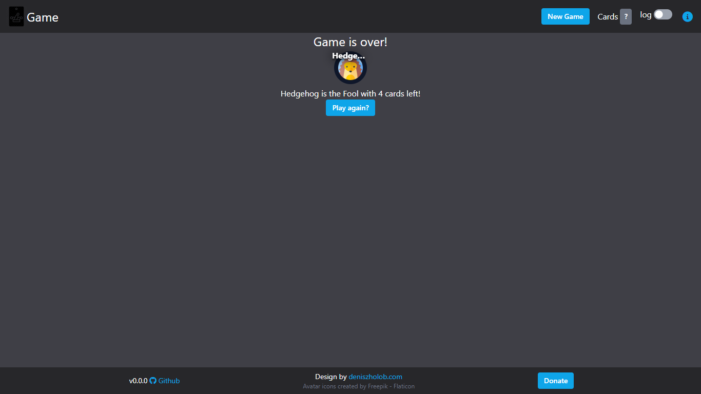

# Durak Card Game 

See https://en.wikipedia.org/wiki/Durak

> Try the [Web Game](https://deniszholob.github.io/durak-card-game/) 
> If you would like to contribute to the code, see [contributing details](CONTRIBUTING.md)

# Support Me

If you find the app or the source code useful, consider:

- Donating Ko-fi: https://ko-fi.com/deniszholob
- Supporting on Patreon: https://www.patreon.com/deniszholob

# Screenshots

